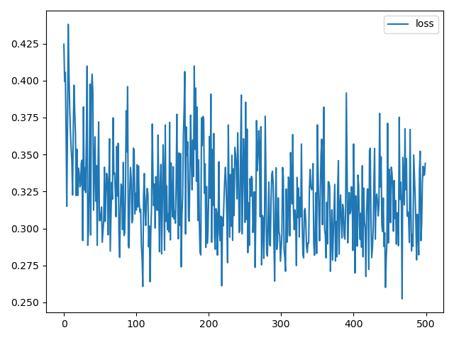
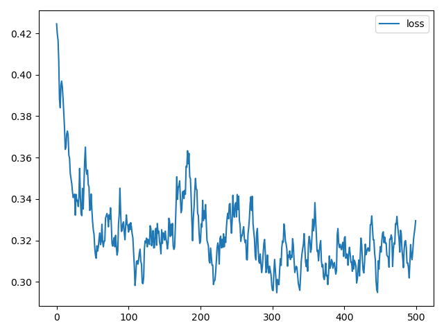
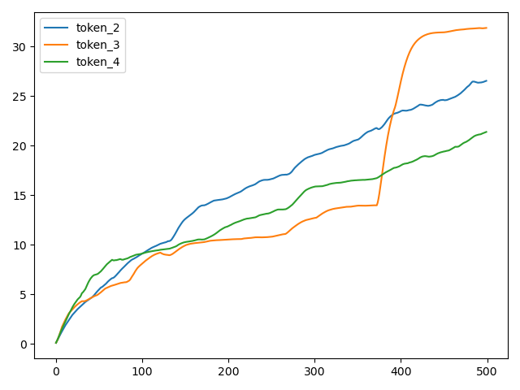

# ExactNum


A CLI for extracting arrays from an unstructured text file and plotting results.

For example, if you print some metrics into a log file, you can use this tool to extract them. This array can be plotting as a diagram to show the trend, or be saved into a stuctured file, e.g., json or csv.

```bash
pip install extractnum
```

## Quick start

### Plot an array from a log file

If you have an unstructured plain text file like:
<pre>
[[032m2022-09-10 21:43:03,770]Total epoch: 0. <b>model loss: 0.42456936836242676</b>.
[[032m2022-09-10 21:43:03,791] token 0 - 5551, 1097.58837890625,  targeting
 token 1 - 1058.235107421875, InstoreAndOnline
 token 2 - 0.10239370167255402,  A
 token 3 - 0.10239171236753464,  sentence
 token 4 - 0.10238830745220184,  :
 token 5 - 977.8533935546875,  predict
 token 6 - 1051.5157470703125, --+
[[032m2022-09-10 21:43:04,297]Total epoch: 1. <b>model loss: 0.39936694502830505</b>.
[[032m2022-09-10 21:43:04,316] token 0 - 5551, 1097.58837890625,  targeting
 token 1 - 1058.3414306640625, InstoreAndOnline
 token 2 - 0.2732486128807068,  A
 token 3 - 0.2605493366718292,  sentence
 token 4 - 0.28173941373825073,  :
 token 5 - 978.6373291015625,  predict
 token 6 - 1051.77685546875, --+
[[032m2022-09-10 21:43:04,840]Total epoch: 2. <b>model loss: 0.40558159351348877</b>.
...
</pre>

And you may want to extract the `model loss` values of all epochs. You can run:
```bash
extractnum training.log --pattern "model loss: {loss}"
```

Here `model loss: ` is the prompt to the numbers, and `{loss}` specifies the placeholder for numbers. `loss` is the label of this array. 

After running, all the loss values in this file can be plotting:



### Smooth the array

ExtractNum supports smoothing the array, like [TensorBoard](https://stackoverflow.com/questions/60683901/tensorboard-smoothing). Run the following command to smooth the loss, which shows the trend more clearly: 

```bash
extractnum training.log --pattern "model loss: {loss}" --smooth 0.8
```



### Plot multiple arrays

You can also plotting multiple arrays together. For example, plot `token 2`, `token 3` and `token 4` in one diagram:

```bash
extractnum training.log --pattern "token 2 - {token_2}" "token 3 - {token_3}" "token 4 - {token_4}"
```




### Save results

If you want to use these data for further usage, you can save them into a csv file.

```bash
extractnum training.log --pattern "token 2 - {token_2}" "token 3 - {token_3}" "token 4 - {token_4}" --output tokens.csv
```

```csv
token_2,token_3,token_4
0.10239370167255402,0.10239171236753464,0.10238830745220184
0.2732486128807068,0.2605493366718292,0.28173941373825073
0.43365949392318726,0.4471507668495178,0.4745367169380188
0.6074557304382324,0.6768703460693359,0.6920053362846375
0.8045746684074402,0.9262861013412476,0.9121480584144592
0.9546961784362793,1.186927080154419,1.1203949451446533
1.1149790287017822,1.4592962265014648,1.3308525085449219
...
```

ExtractNum detects the output format automatically by the path extension. Currently, the following formats are supported: 

- Any `image format` that matplotlib supports: save as an image file. 
- `*.csv`: save as a csv table format. 
- `*.json`: save as a json format. 
- `*.txt` / `stdout`: print a table to a text file or the standard output. 
- otherwise, show a matplotlib image window.


## How does it work?

For each input pattern (e.g., `model loss: {loss}`), ExtractNum will replace the placeholder `{loss}` into a regex pattern. By default, a real number regex pattern `[+|-]?\d*(\.\d*)?` is used, and you can change it by `--placehold_pattern {regex}`. Using this processed regex pattern, ExtractNum  scan the log file by lines and try to extract it. The label `loss` will be served as a group name in the processed pattern. You can also turn on the `--regex` mode, which regards the input pattern as a regex pattern without any further processing, and regard the group name as the label.

## Usage
```
usage: extractnum [-h] [--pattern [<number pattern> ...]] [--x <label>]
                  [--regex] [--placehold_pattern <regex>] [--output <path>]
                  [--smooth <weight>] [--offset <offset>] [--limit <limit>]
                  [--verbose]
                  log_file

positional arguments:
  log_file              Log file path to parse

optional arguments:
  -h, --help            show this help message and exit
  --pattern [<number pattern> ...], -p [<number pattern> ...]
                        Pattern for extracting real numbers from log. For
                        example, for a log line 'training acc: 3.14%', a
                        pattern 'acc: {accuracy}' will extract 3.14, and plot
                        it with a label 'accuracy'. Note that this pattern
                        could only handle simple case. For a more complicated
                        case, please turn on --regex mode.
  --x <label>           Specify a label as the X array for plotting. For
                        example, if there exists an array with a label
                        "iteration", you can use "--x iteration" to make this
                        array as the plotting X array. Not that the label
                        should be in one of the patterns. By default, a
                        sequence of natural numbers will be used.
  --regex               Regex mode. If enable, patterns will be interpreted as
                        regex patterns. For example, for a log line 'training
                        acc: 3.14%', a pattern
                        'acc:\s(?P<accuracy>[+|-]?\d*(\.\d*)?)' will extract
                        3.14, and plot it with a label 'accuracy'.
  --placehold_pattern <regex>
                        The regex to replace the placeholder label. By
                        default, a real number regex is used:
                        "[+|-]?\d*(\.\d*)?".
  --output <path>, -o <path>
                        Output path. It supports the following types: (1) Any
                        image format that matplotlib supports: save as an
                        image file. (2) *.csv: save as a csv table format. (3)
                        *.json: save as a json format. (4) *.txt / stdout:
                        print a table to a text file or the standard output.
                        (5) otherwise, show a matplotlib image window.
  --smooth <weight>     Perform exponential moving average to smooth values
                        when plotting. Default: 0
  --offset <offset>     The number of skipping lines before parsing. Default:
                        0
  --limit <limit>       Max numbers for each label in parsing. 0 indicates no
                        limits. Default: 0
  --verbose, -v         Verbose mode.

```